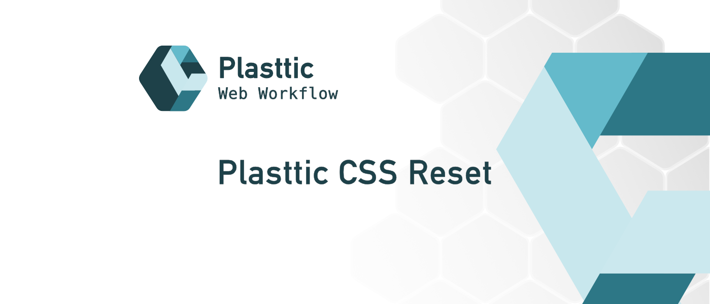

[](https://plasttic.dev)

# Plasttic CSS Reset

A CSS Reset styling for browser consistency with best practices defaults.

[](https://www.npmjs.com/package/plasttic-reset)&ensp;&ensp;[](https://github.com/tojeiro-me/Plasttic-reset/blob/master/LICENSE)&emsp;[](https://twitter.com/Plasttic_Dev)

---

## About

Plasttic CSS Reset creates a clean and stripped foundation to develop an accessible, responsive and robust interface by applying your design system on a blank canvas.

- Removes browser inconsistencies.
- Resets properties for easier and more predictable styling results.
- Improves accessibility through best practices values.
- Uses :where() to allow overrides without specificity issues.
- Offers custom properties to change some of the default values.

---

## Demo page

- https://codepen.io/tojeiro/pen/mdzYVjP?editors=1100

---

## Start

### From CDN (HTML page)

```HTML
  <link rel="stylesheet" href="https://unpkg.com/plasttic-reset@2.1" />
```

### From CDN (CSS file)

```CSS
@import "https://unpkg.com/plasttic-reset@2.1";
```

### Installation

:warning: **NOTE: Installing is not recommended for production. Properties can be added or modified in later versions. If you update the project dependencies, the new version can break your layout.**

1. Install package

```
npm i plasttic-reset
```

2. Import in the CSS file

```CSS
@import "plasttic-reset";
```

### Download

1. Download Zip

```
https://github.com/tojeiro-me/Plasttic-reset/archive/refs/heads/master.zip
unzip file
```

2. In the HTML page (no automatic update)

```HTML
  <link rel="stylesheet" href="/path-to-file/reset.min.css" />
```

---

Check the [CHANGELOG](CHANGELOG.md) for version changes.

---

## Customize

The typography default values are based on the W3C recommendations. However he fonts used and their sizes can have a considerable impact.

The focus color is intended for users navigating using the keyboard or assistive technologies.

This properties can be changed globally - using the `:root` pseudo-class - or `scoped` - inside the tag or class in which you want to override the default values.

```CSS
  :root {
      /* Focus style color */
      --ptt-reset-focus-color: hsl(26 86% 61%); /* replace with brand color, ... */

      /* The next properties best values depends on the font used */
      --ptt-reset-body-line-height: 1.45; /* 1.4 to 1.6 */
      --ptt-reset-body-width: 65ch; /* 50ch to 80ch - h5, h6, p, li */
      --ptt-reset-body-spacing: 0.012em; /* letter spacing */
      --ptt-reset-header-line-height: 1.1; /* 1 to 1.2 - h1, h2, h3, h4 */
      --ptt-reset-h1-width: 30ch;
      --ptt-reset-h2-width: 35ch;
      --ptt-reset-h3-width: 45ch;
      --ptt-reset-h4-width: 55ch;

      /* Better spacing between content */
      --ptt-reset-content-space-top: 0.5em;
      --ptt-reset-header-space-bottom: 0.75em; /* h1, h2, h3, h4 */
      --ptt-reset-header-space-top: 2em;
      /* h2, h3, h4, h1: if not inside a header with role=banner */
  }
```

---

## Notes

### Styling file upload button

```CSS
input[type='file']::-webkit-file-upload-button,
input[type='file']::file-selector-button {
  /* styling properties */
}
```

### Lists

Apply the role=list when styling lists (ul/ol) with list-style=none so it doesn't loose its semantic value on safari.

```CSS
ul {
  list-style: none;
}

<ul role="list">
```

---

## Developer

1. Repository

- https://github.com/tojeiro-me/Plasttic-reset

2. CSS Files:

- Minified: dist/reset.min.css
- Source: src/reset.css

3. Config files

- Supported Browsers: .browserslistrc (https://browsersl.ist/)
- PostCSS preset-env stage: postcss.config.cjs (https://github.com/csstools/postcss-preset-env#stage)

4. Repository

- Clone repository

```

git clone https://github.com/tojeiro-me/Plasttic-reset.git

```

- Install dependencies

```

npm install

```

- Parse and Minimize source to dist (reset.min.css)

```

npm run dist

```

---

Inspired by the work of:

- Andy Bell @piccalilli\_
- https://piccalil.li/blog/a-modern-css-reset/
- Comeau @JoshWComeau
- https://www.joshwcomeau.com/css/custom-css-reset/
- Adam Argyle @argyleink
- https://codepen.io/argyleink/pen/KKvRORE

_"Credit where credit is due!"_

## Follow

---

[](https://twitter.com/Plasttic_Dev)&emsp;[](https://mastodon.social/@plasttic)&emsp;[](https://github.com/tojeiro-me)

---

## License

[MIT](./LICENSE)

---

[](https://github.com/tojeiro-me/Plasttic)

```

```
